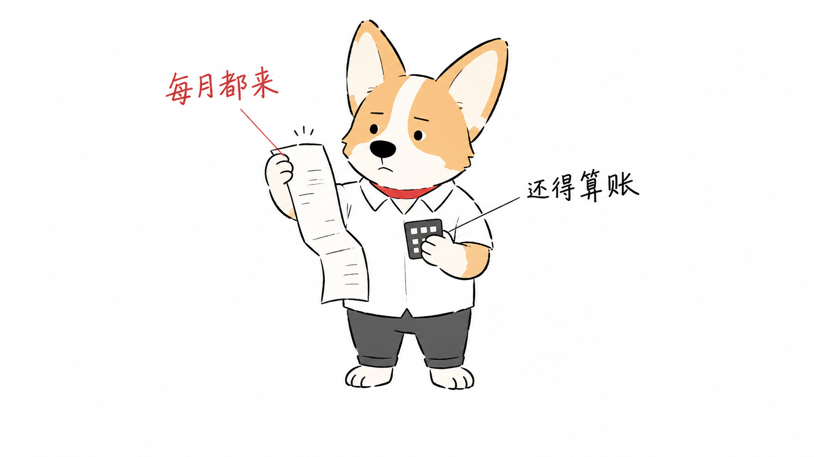

# 口播手绘配图 · 柯基版

为中文口播科普视频和文章生成连贯的手绘配图：默认采用极简线描拟人柯基，配合短中文解释性引线标注。

本仓库是 [Ian Xiaohei Illustrations](https://github.com/helloianneo/ian-xiaohei-illustrations) 的改编版本。保留技能名称 `ian-xiaohei-illustrations` 和原调用方式，新增可替换角色、视频分镜与标注规则。原版小黑仍可选用。

## 默认角色与画风



白底、简洁细黑线、少量橙白色面、红项圈、白衬衫和深灰裤子。保留柯基的大耳朵、白色额头纵纹和短腿，动作、表情与道具随口播变化。

这张图同时用作角色与画风参考。账单、计算器、文字和姿势属于示例场景，不会被要求复制到每张图。角色连续性仍需在实际生成后逐图检查。

## 一个 Skill，两种模式

| 模式 | 什么时候用 | 交付 |
|---|---|---|
| 角色设计 | 设计主角、替换角色或比较新画风时 | 候选图、选定的角色参考和身份档案 |
| 内容配图 | 已有角色，需要为口播或文章配图时 | 分镜、逐镜提示词、图片及必要的标注计划 |

日常生成直接复用已选角色；没有另外指定时使用内置柯基。角色档案与参考图单独保存，换主角不需要重写分镜、构图和标注规则。

角色不必出现在每个镜头：街角环境、机器特写、地图或统计图可以独立表达内容。视频默认 16:9，并在底部为字幕预留空间；用户指定的画幅优先。

## 解释性引线标注

- **引线标注**：短文字对应到具体对象或部位，例如“每月都来”指向周期性费用。
- **流向箭头**：表达动作、资金流或时间顺序，与文字引线分别设计。
- **手写旁注**：提示一个状态或反差，不必强行连线。
- **来源注释**：说明数据出处与口径，优先后期叠加可编辑文字。

解释镜头通常使用 2–4 条必要短标注，避免交叉、穿脸和指错物件。纯场景可无标注。来源注释不等于事实核验；不能把宣传说法或未核实数字画成官方统计。

## 使用示例

### 生成一组口播配图

```text
Use $ian-xiaohei-illustrations 为下面的口播生成一组配图。
沿用内置极简线描柯基，16:9 白底，加入必要的解释性引线标注。
按内容转折安排环境、动作、细节和观点镜头，底部给字幕留白。

<粘贴口播>
```

### 先做分镜

```text
Use $ian-xiaohei-illustrations 先不要生图。
请把下面口播拆成分镜，记录每镜对应的口播、核心意思、景别与动作、
角色是否出场、标注文字和准确引线目标。

<粘贴口播>
```

### 更换主角

```text
Use $ian-xiaohei-illustrations 以我附上的动物图片设计一个拟人主角。
生成 3 个风格候选，用相同场景和动作方便比较。
我选定后保存角色参考与身份档案，供后续内容配图复用。
```

### 使用原版小黑

```text
Use $ian-xiaohei-illustrations 这次使用原版小黑，为“信任需要证据”生成一张配图。
```

更多生成与编辑示例见 [examples/prompts.md](examples/prompts.md)。

## 安装

```bash
git clone https://github.com/datehoer/ian-xiaohei-illustrations.git
cd ian-xiaohei-illustrations
```

复制子目录到 Codex skills 目录。若已安装同名技能，先备份原目录，再替换，避免新旧文件混用。

```bash
mkdir -p "${CODEX_HOME:-$HOME/.codex}/skills"
cp -R ./ian-xiaohei-illustrations "${CODEX_HOME:-$HOME/.codex}/skills/"
```

此 fork 与原版共用 `ian-xiaohei-illustrations` 名称，作为原版的替换版本使用。实际图像生成依赖运行环境提供的图像工具，仓库不包含模型服务或 API 密钥。

## 目录与维护

可安装的子目录 [ian-xiaohei-illustrations](ian-xiaohei-illustrations/) 包含：

- [SKILL.md](ian-xiaohei-illustrations/SKILL.md)：任务路由与共用流程。
- [character-design.md](ian-xiaohei-illustrations/references/character-design.md)：角色设计模式。
- [corgi-minimal.md](ian-xiaohei-illustrations/references/characters/corgi-minimal.md) 与 `assets/characters/`：默认身份档案和参考图。
- [annotations.md](ian-xiaohei-illustrations/references/annotations.md)：引线、箭头、旁注与来源规则。
- `references/` 中的风格、构图、提示词和 QA：共用的内容生成规则。
- `assets/examples/`：14 张上游小黑校准图，仅在选用小黑或明确参考旧样例时读取。
- `LICENSE`、`EARTH-LICENSE`、`NOTICE.md`：随技能分发的许可证与来源说明。

修改后运行：

```bash
python3 scripts/quick_validate.py .
```

检查覆盖目录结构、任务路由、文档本地链接、角色参考资产、上游样例画幅和明显未完成标记；视觉质量、角色连续性和引线指向仍需生成后目视检查。

## 上游小黑校准样例

下面 8 张来自 Ian 的原版，保留用于对照与可选小黑模式，当前默认角色以上方柯基参考为准。样图用于观察视觉语言，不要求复制旧物件、构图或隐喻。

<details>
<summary>展开原版示例</summary>


</details>

## 来源与许可

原作 [Ian Xiaohei Illustrations](https://github.com/helloianneo/ian-xiaohei-illustrations) 由 Ian 创建，以 MIT 许可证发布。改编也参考了 [Earth Inky Illustrations](https://github.com/nafiul-earth/earth-inky-illustrations) 的角色替换与短注释思路，以及 [handraw-style](https://github.com/yang0/handraw-style) 的通用画风分类；未复制 handraw-style 的图片库或脚本。

完整来源、改编边界与参考版本见 [NOTICE.md](NOTICE.md)。许可证见 [LICENSE](LICENSE) 和 [EARTH-LICENSE](ian-xiaohei-illustrations/EARTH-LICENSE)。
